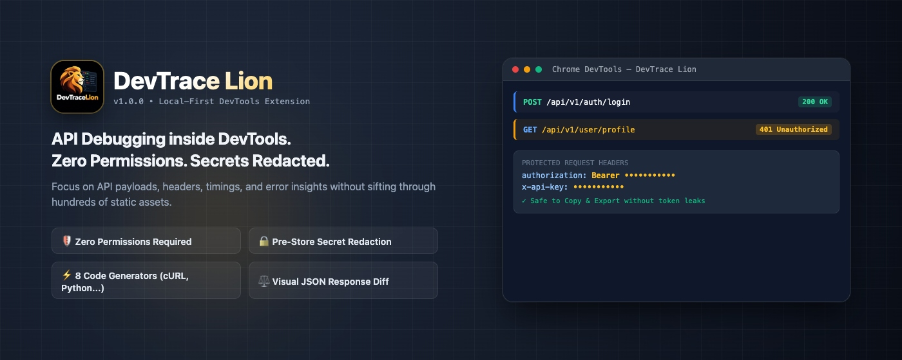
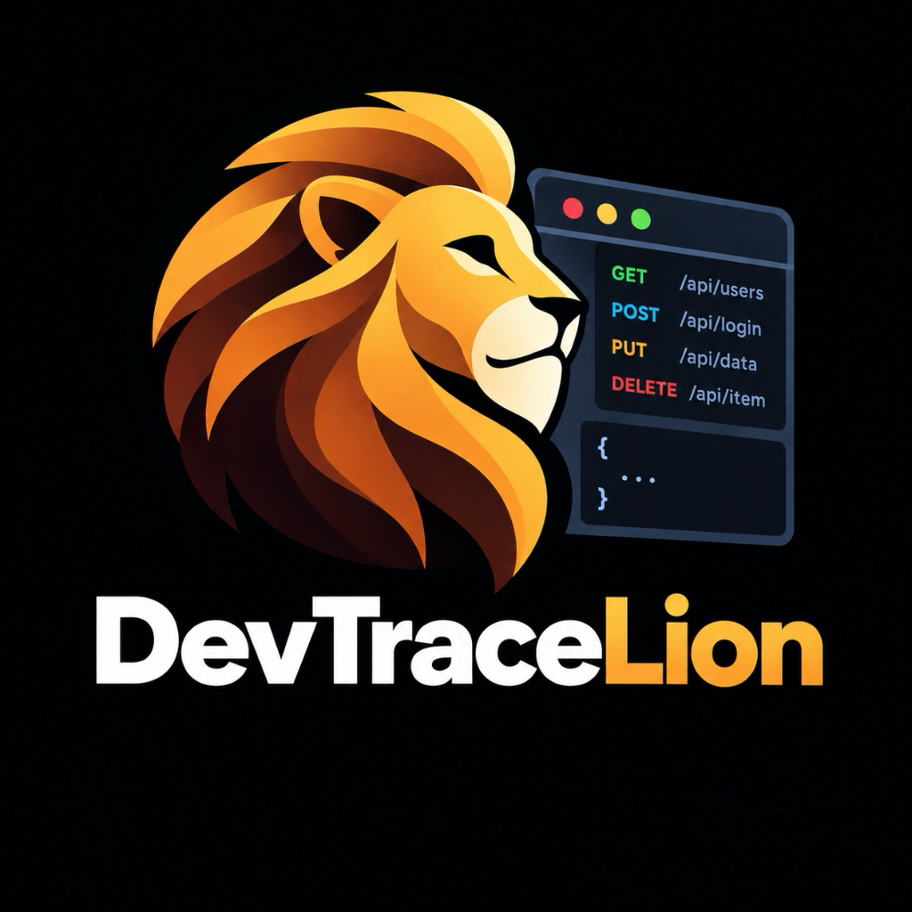
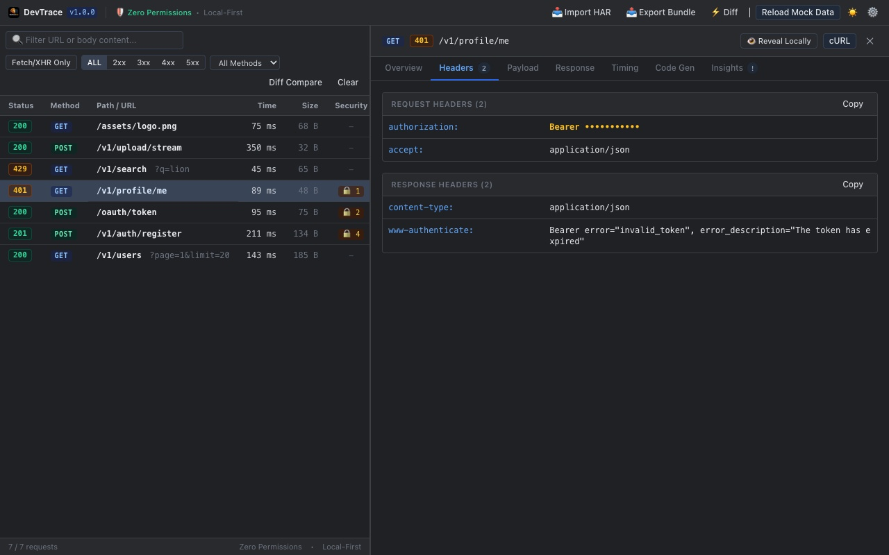
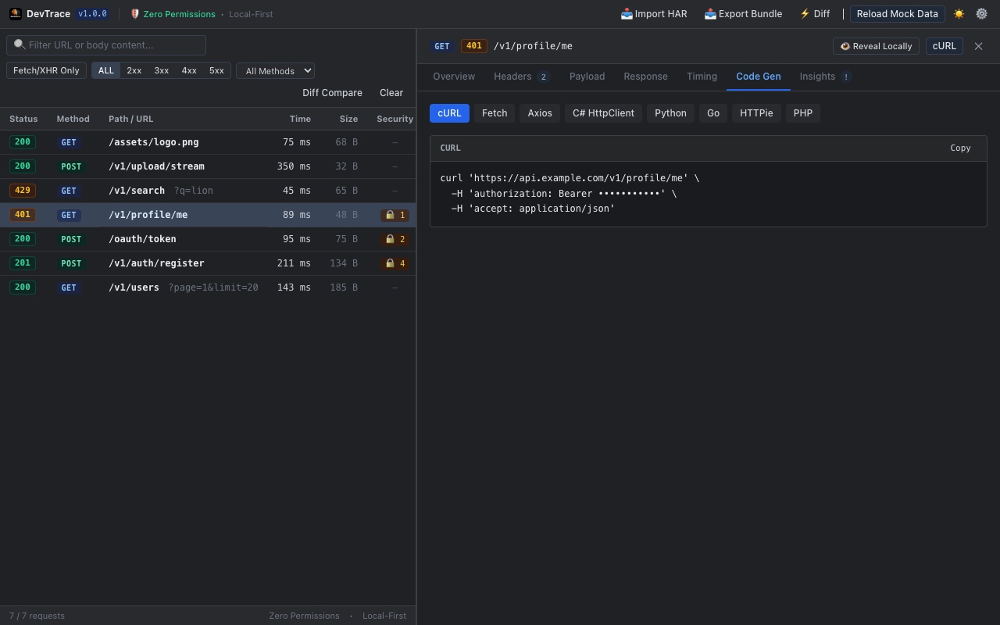
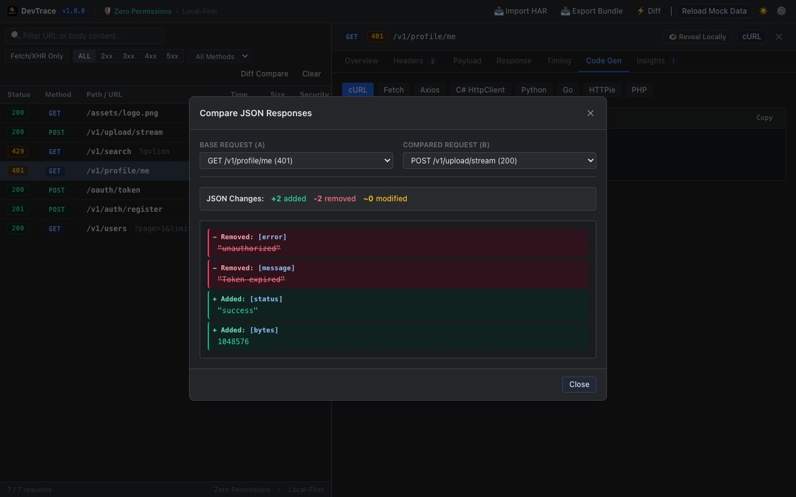
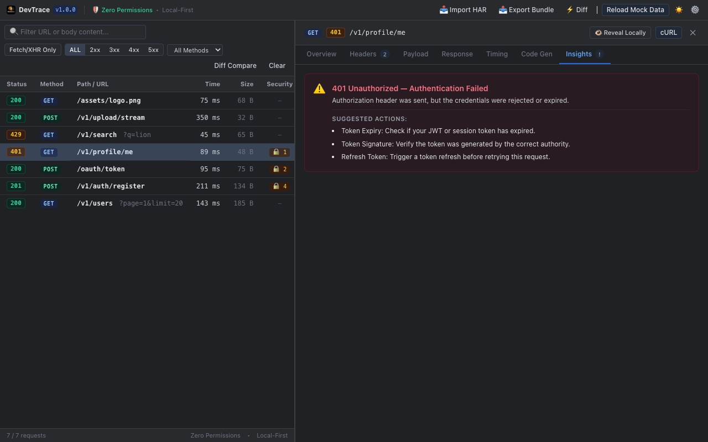
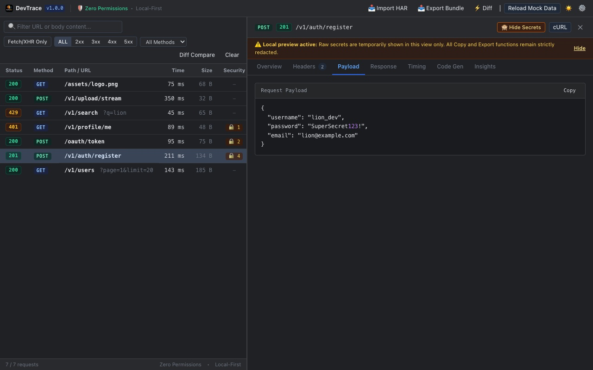

<p align="center">
  
</p>

<p align="center">
  
</p>

<h1 align="center">DevTrace Lion 🦁</h1>

<p align="center">
  <strong>API debugging inside browser DevTools. Zero permissions. Local-first. Pre-store secret redaction. 8-language code generator.</strong>
</p>

<p align="center">
  <a href="https://github.com/malilion/DevTraceLion/actions/workflows/ci.yml">
    
  </a>
  <a href="LICENSE">
    
  </a>
  
  
  
  
</p>

<p align="center">
  <a href="#-devtrace-lion-in-60-seconds">60-Second Overview</a> •
  <a href="#-visual-feature-walkthrough">Feature Walkthrough</a> •
  <a href="#-30-second-quick-start">Quick Start</a> •
  <a href="#-keyboard-shortcuts">Shortcuts</a> •
  <a href="#-security--privacy-manifesto">Security Manifesto</a> •
  <a href="README.zh-TW.md">繁體中文說明文件</a>
</p>

---

## ⚡ DevTrace Lion in 60 Seconds

When debugging web applications, developers open browser DevTools every single day. But traditional DevTools have common frustrating pain points:

* ❌ **Asset Noise Overload**: Reloading a webpage triggers 300+ requests (images, CSS, fonts, analytics scripts). Finding your specific API call is like finding a needle in a haystack.
* ❌ **Accidental Credential Leaks**: When asking a backend engineer for help, pasting a raw cURL command into Slack, Teams, or GitHub Issues accidentally leaks your real `Authorization: Bearer <JWT>`, session cookies, or passwords.
* ❌ **"Give me a repro snippet"**: Frontend files an issue, and the backend asks for a Python, C#, or Go script to reproduce it locally.
* ❌ **API Schema Regressions**: The backend says *"The new API version is 100% backward compatible"*, forcing you to manually compare large JSON responses line by line.

---

### 👉 How DevTrace Lion Solves This:

1. 🎯 **Noise Filtered**: Isolates and displays **Fetch & XHR (REST API)** requests only.
2. 🛡️ **Pre-Store Redaction**: Masks `Authorization`, Cookies, passwords, API keys, and secret URL query params as `•••••••••••` **before** data enters memory. Anything you copy or export is 100% leak-proof!
3. 📋 **8 Code Generators**: Instantly switch between cURL, Fetch, Axios, C# HttpClient, Python requests, Go net/http, HTTPie, and PHP cURL.
4. ⚖️ **Visual JSON Diff**: Compare any two responses with clear color coding: `+ Added` (green), `- Removed` (red), and `~ Modified` (yellow).
5. 💡 **Smart Status Insights**: Instant root-cause analysis for 401 (missing header vs expired token), 429 (retry wait calculation), 500 (HTML crash page detection), and CORS failures.
6. 🔒 **Zero Permissions**: Manifest strictly declares `permissions: []`. Runs entirely in local RAM, sends zero network telemetry, and complies with enterprise security policies.

---

## 📸 Visual Feature Walkthrough

### 1. Dedicated API Panel & Pre-Store Redaction
> Open browser DevTools to find the dedicated **DevTrace** tab. Requests are grouped cleanly by HTTP status, and sensitive authentication headers are automatically masked with amber lock icons.

<p align="center">
  
</p>

* **Protected Scope**:
  * **Headers**: `Authorization`, `Cookie`, `Set-Cookie`, `X-Api-Key`, `Proxy-Authorization`, etc.
  * **JSON Payloads**: `password`, `token`, `access_token`, `refresh_token`, `secret`, `client_secret`, etc.
  * **URL Query Parameters**: Secrets in query strings (e.g. `?token=...`, `?api_key=...`) are sanitized and re-encoded.
* **Custom Keys**: Add proprietary organizational tokens in **Settings (⚙️)**.

---

### 2. Multi-Language Code Generators
> Select any captured request, switch to the **Code Gen** tab, and copy production-ready code with one click.

<p align="center">
  
</p>

* **8 Supported Languages & Clients**:
  1. **cURL** (Terminal / Shell)
  2. **JavaScript / TypeScript** (Standard `fetch`)
  3. **Axios** (Web & Node.js)
  4. **C#** (`HttpClient`)
  5. **Python** (`requests`)
  6. **Go** (`net/http`)
  7. **HTTPie** (Modern CLI)
  8. **PHP** (Standard `cURL`)
* Automatically strips HTTP/2 and HTTP/3 pseudo-headers (`:authority`, `:method`, `:path`, `:scheme`), making snippets immediately executable in IDEs and terminals.

---

### 3. Visual JSON Response Diff
> Click the **"⚡ Diff"** button on the top navigation bar, select Base Request (A) and Compared Request (B), and inspect the structural difference.

<p align="center">
  
</p>

* **`+ Added` (Green)**: Properties newly introduced in the compared response.
* **`- Removed` (Red)**: Properties missing or dropped in the compared response.
* **`~ Modified` (Yellow)**: Properties where values have changed.
* A summary counter (e.g. `+2 added, -2 removed, ~0 modified`) gives an instant snapshot of schema changes.

---

### 4. Smart Status Insights & Diagnostics
> When an API returns a 4xx or 5xx error, switch to the **Insights** tab for zero-latency, local root-cause diagnostics and recommended fixes.

<p align="center">
  
</p>

* **401 Unauthorized**: Detects whether the request lacked credentials entirely, or sent credentials that expired/failed validation.
* **429 Too Many Requests**: Reads the `Retry-After` response header and converts it into human-readable seconds.
* **500 Internal Server Error**: Flags whether the server crashed with an HTML template (e.g. Nginx/Cloudflare 502/504 gateway error).
* **Status 0**: Flags CORS preflight rejections, missing `Access-Control-Allow-Origin`, self-signed certificates, or network drops.

---

### 5. Reveal Locally & Safety Guarantee
> Need to view your raw credentials during local development? Click **"👁️ Reveal Locally"**.

<p align="center">
  
</p>

* **Double-Isolation Protection**:
  * A prominent amber warning banner informs you that raw preview is active for the current card.
  * **Zero-Leak Guarantee**: Even while unmasked locally, clicking "Copy", "cURL", or "Export Bundle" **always exports the redacted version** (`Bearer •••••••••••`). Raw secrets are isolated in memory and never accessible to export functions.

---

## 🚀 30-Second Quick Start

### Step 1: Clone and Build
```bash
# Clone repository
git clone https://github.com/malilion/DevTraceLion.git
cd devtrace-lion

# Install dependencies
pnpm install

# Build Chrome MV3 extension
pnpm build
```
*(Build output is located in `.output/chrome-mv3`)*

---

### Step 2: Load Extension in Browser

#### 👉 Chrome / Edge / Brave:
1. Open your browser and navigate to `chrome://extensions/`
2. Enable **"Developer mode"** in the top-right corner.
3. Click **"Load unpacked"** in the top-left corner.
4. Select the **`.output/chrome-mv3`** folder inside the project directory.

#### 👉 Firefox:
1. Run `pnpm build:firefox` to build the Firefox package.
2. Navigate to `about:debugging#/runtime/this-firefox`.
3. Click **"Load Temporary Add-on"** and select `.output/firefox-mv2/manifest.json`.

---

### Step 3: Start Debugging!
1. Press `F12` (or `Cmd + Option + I` on Mac) to open DevTools.
2. Click the **"DevTrace"** tab in the top tab bar (click `>>` if hidden).
3. Refresh the webpage or interact with the app to monitor clean, secure API traffic!

---

## 🧪 Standalone Mock Mode

You can preview the interface and test all features without opening DevTools:

```bash
# Start local dev server
pnpm dev
```
Then visit in your browser:
```text
http://localhost:3000/panel.html?mock=1
```
Pre-configured mock fixtures (GET 200, POST 201, 401 Bearer, 429 Retry-After, binary PNG, etc.) will load automatically.

---

## ⌨️ Keyboard Shortcuts

| Key | Action |
| :---: | :--- |
| `/` | Focus search bar to quickly filter endpoints |
| `c` | Instantly copy safe, redacted **cURL command** for selected request |
| `d` | Open **JSON Diff** comparison modal |
| `x` | Clear all captured records |
| `Esc` | Close any active modal (Settings, Diff Viewer) |

---

## 🔒 Security & Privacy Manifesto

1. **Zero Permissions**: Manifest declares `permissions: []`. No `<all_urls>`, no web navigation tracking, no cookie sniffing.
2. **RAM Only (Volatile)**: Captured requests are held exclusively in session RAM and completely purged when DevTools closes.
3. **No External Network Calls**: Zero telemetry, no Google Analytics, no tracking pixels, zero cloud dependencies.
4. **Copy-Safe Guarantee**: Copying headers, payloads, or code snippets *always* produces redacted text.

Read our complete [SECURITY.md](SECURITY.md) and [PRIVACY.md](PRIVACY.md).

---

## 🛠️ Development Scripts

```bash
# Strict TypeScript checking
pnpm typecheck

# Run full test suite (54 tests)
pnpm test

# Run code linter
pnpm lint

# Automatically re-generate Chrome Web Store screenshots and promo tiles
pnpm assets:store
```

---

## 🤝 Contributing

Contributions are welcome! Please check out [CONTRIBUTING.md](CONTRIBUTING.md) for guidelines, development workflows, and a list of good first issues.

---

## 📄 License

DevTrace Lion is open-source software licensed under the [MIT License](LICENSE).  
Part of the **Malilion Browser Tools** ecosystem.
